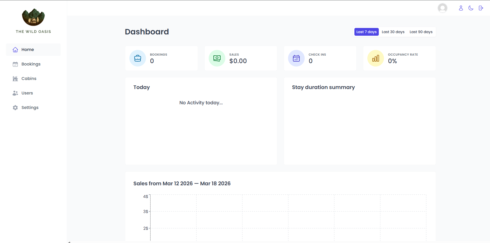

# React The Wild Oasis App

A Full Stack Wild Oasis app (Admin POV) built with React.

# Highlights

- Built an admin dashboard with Home, Bookings, Cabins, Users, and Settings sections to manage the reservation system.
- Implemented Bookings management for handling reservations, updates, and monitoring transactions.
- Created a Cabins module for adding, editing, and deleting cabin listings with validation.
- Developed Users functionality for creating new users and managing accounts.
- Implemented a database to store users, cabins, and bookings, ensuring secure and structured data management.
- Configured Settings to manage hotel rules and limits, including maximum and minimum booking requirements.

# Technologies

- Vite
- JavaScript
- Tailwind
- React
- React Router
- React Query
- Node.js
- Supabase

# View Live Demo

https://gce-react-the-wild-oasis.vercel.app/
